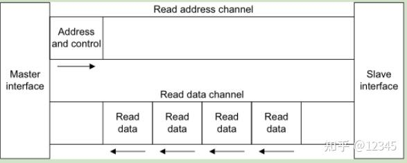
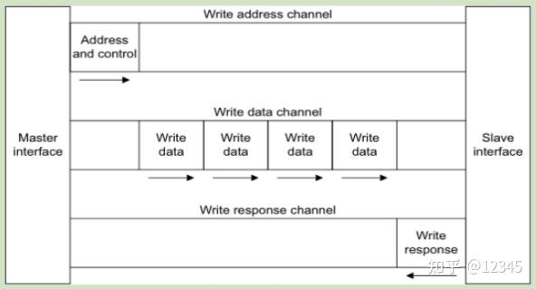
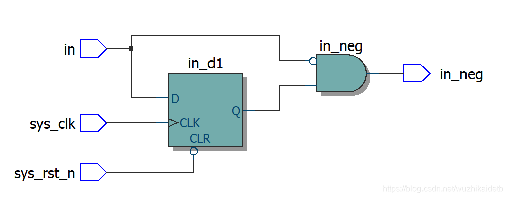
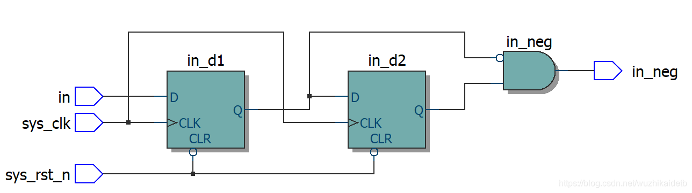

# 数字逻辑电路基础实验

verilog代码在.src文件夹中，使用vivado 2018.3进行仿真。

## 1. 根据电路图写代码

Lab1_task2.v

根据以下电路图完成代码的书写。

## 2. 序列检测 

序列检测分为有重叠检测和无重叠检测；

例如检测序列1101011，我们给出输入：110101101011。

如果是无重叠检测，则只能检测到一个序列：1101011_01011;

如果是有重叠检测，则可以检测到两个这样的序列：11010_11_01011。

### 2.1. 不重叠序列检测

seq_detect.v

随机序列中xxx101101xxx检测序列“101101”（左先），每检测到一个序列输出一个周期的脉冲，输入:clk,rstn,data_in，输出:detector， 仅检测不重叠的101101序列。

### 2.2. 可重叠序列检测

seq_detect_overlap.v

随机序列中xxx101101xxx检测序列“101101”（左先），每检测到一个序列输出一个周期的脉冲，输入:clk,rstn,data_in，输出:detector， 检测可重叠的101101序列。

## 3. 序列求余

Lab2_task2.v

现有16位寄存器。初始值为0。每个时钟周期寄存器的值会左移1位，并且将输入的数据data_in作为寄存器的最低位，寄存器原来的最高位将被丢弃。要求每个周期实时输出该16位寄存器对7求余的余数data_out[2:0]。不能直接用求余运算符。

思路：如果寻求直接求一个给出的16位二进制数对7的余数，会比较麻烦，但是已知从0开始，并且每次移进去1或0，这个过程中的变化是确定的，就可以写出对应状态机。

这是最高位不为0时候的状态机，此时每一次进0/1相当于乘2或者乘2+1，符合这个状态机，如果最高位是1，就不是乘2和乘2加1，不符合这个状态机，需要另设计转移方式！这才是最高位是1时候的转换图。

## 4. FIFO

### 4.1. 同步FIFO

FIFO.v

设计一个同步FIFO，该FIFO深度为16，每个存储单元的宽度为8位，要求产生FIFO为空、满、半满、溢出标志。

其中，clk：输入时钟；rst_n：输入复位信号，低电平有效；w_en：写使能；r_en：读使能；data_w：写入FIFO的数据；data_r：从FIFO中读出的数据；empty：读空信号，指示FIFO为空；full：写满信号，指示FIFO为满；half_full：半满信号；overflow：溢出信号，当FIFO已经满的时候，继续有写入的数据时跳为1。

实验要求：

- 有效，复位后，空信号empty=1，满信号full=0，内部写地址、读地址指针指向0rst_n低。
- clk上升沿根据w_en和r_en信号决定读写，w_en和r_en信号均为高有效。
- 基于提供的tb，不停顿执行完表示功能通过(输出“ndone, without error”)。

要点：

- 判空满方法：指针多一位，可以表示溢出的情况，类似循环指针，两个指针差为最大范围时满，相等时空。
- 数值的地址的读写时，注意空不能读，满不能写。
  

### 4.2. 位宽转换

FIFO_8_to_3.v

基于FIFO进行位宽的转换，要求在数据写入FIFO时使用8bit位宽，读出FIFO时使用3bit位宽。

思路：输出是一个状态机。

## 5. 时钟

### 5.1. 时钟分频

clk_div.v

将主时钟以2为幂次进行分割可以得到同步偶数分频时钟，即21，22，23...分频。电路上可采用D触发器实现，n个触发器可以构成2n次偶数分频。如图1所示，为2分频、4分频电路设计及波形。

用D触发器级联搭建分频电路只能实现2，4，8，16等分频，对于一般的偶数分频，可以通过计数器实现：若要实现N分频（N为偶数），只需将计数器在待分频时钟上升沿触发下循环计数，从0计数到（N/2 -1）后将输出时钟翻转即可实现。

对于奇数分频，就是分别利用待分频时钟的上升沿触发生成一个时钟，然后用下降沿触发生成另一个时钟，然后将两个时钟信号进行或/与运算得到占空比为50%的奇数分频。

占空比为50%的7分频电路波形生成：

### 5.2. 时钟

clock.v

## 6. FIR

FIR.v

FIR滤波器 (Finite Impulse Response Filter)，通过与 AXI 接口交互进行信号处理。

### 6.1. 行为描述

流水线操作：

- Pipeline1：将输入数据从 AXI 接口加载到 data_tmp 中。

- Pipeline2：对输入数据进行加权和乘法处理，例如 h0*(data[0] + data[15])。

- Pipeline3-5：通过多级加法器对乘法结果进行加总。

AXI接口：通过 S_AXIS_TVALID 和 M_AXIS_TREADY 进行数据传输，并通过 S_AXIS_TLAST 和 M_AXIS_TLAST 信号标记数据的开始和结束。

### 6.2. 数据位宽分析

最小的数据宽度应考虑每个阶段的数据溢出。数据输入为8位。首先，在MAC操作中，两个8位数字可能会生成一个9位数字。然后，9位数字与一个5位有符号数相乘，得到一个14位数字。在流水线加法器的第一阶段，两个14位数字相加为一个15位数字。在流水线加法器的第二阶段，两个15位数字相加为一个16位数字。在流水线加法器的最后阶段，两个16位数字相加为一个17位数字。因此，输出的最小数据宽度为17。

### 6.3. AXI 总线协议

AXI使用基于 VALID / READY 的握手机制数据传输协议，传输源端使用 VALID 表明地址/控制信号、数据是有效的，目的端使用 READY 表明自己能够接受信息，最值得注意的点包括：

- 当 VALID(AxVALID/xVALID) 信号断言有效时，它必须保持处于已断言有效状态直至从接口断言 AxREADY/xREADY 有效后出现上升时钟沿为止；
- 发送信息的AXI接口的 VALID 信号不得从属于接收该信息的AXI接口的 READY 信号。但是，READY 信号的状态可从属于 VALID 信号；
- 写响应必须始终位于所属的写入传输事务中最后一次写入传输之后；
读数据必须始终位于数据相关的地址之后；
- 从接口必须等待断言 ARVALID 和 ARREADY 有效后，才能断言 RVALID 有效以指示该有效数据可用。

AXI 能够使 SoC 以更小的面积、更低的功耗，获得更加优异的性能。AXI  获得如此优异性能的一个主要原因，就是它的单向通道体系结构。单向通道体系结构使得片上的信息流只以单方向传输，减少了延时。除了降低延时，AXI 总线还定义了在进出低功耗节电模式前后的握手协议。规定如何通知进入低功耗模式，何时关断时钟，何时开启时钟，如何退出低功耗模式。这使得所有 IP 在进行功耗控制的设计时，有据可依，容易集成在统一的系统中。AXI 的特点如下：

- 单向通道体系结构。信息流只以单方向传输，简化时钟域间的桥接，减少门数量。当信号经过复杂的片上系统时，减少延时；
- 支持多项数据交换。通过并行执行猝发操作，极大地提高了数据吞吐能力，可在更短的时间内完成任务，在满足高性能要求的同时，又减少了功耗；
- 独立的地址和数据通道。地址和数据通道分开，能对每一个通道进行单独优化，可以根据需要控制时序通道，将时钟频率提到最高，并将延时降到最低；
- 增强的灵活性。AXI 技术拥有对称的主从接口，无论在点对点或在多层系统中，都能十分方便地使用 AXI 技术。

## 7. 自动售货机

vending_machine.v

### 7.1. 按键消抖

debounce.v

消抖电路用来等待一个稳定的状态，输入参数N用来决定等待多少个周期。在N个周期之后，按键的输出才改变。

### 7.2. 上升沿检测

posedge_detect.v

在 btn 信号的上升沿时输出一个脉冲信号 pos_edge。通过使用 2 位寄存器 D 保存 btn 的前一时刻和当前状态，检测 btn 从低电平到高电平的过渡（上升沿）。

### 7.3. 状态机

这是一个Mealy状态机，因为输出Money取决于输入的Dollars和cents，但是输出Deliver仅仅取决于当前的状态。

当输入按钮没有enable的时候，输入的钱会被累计，当enable信号有效时，售货机开始工作。

当检测到输入的钱比售价更多时，状态转移到找零；如果检测到输入的钱与售价相等，则不需要找零，并给出货物。下一个周期，钱将被清空，等待下一次被激活。

