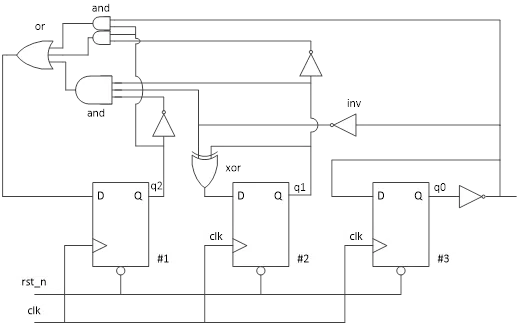
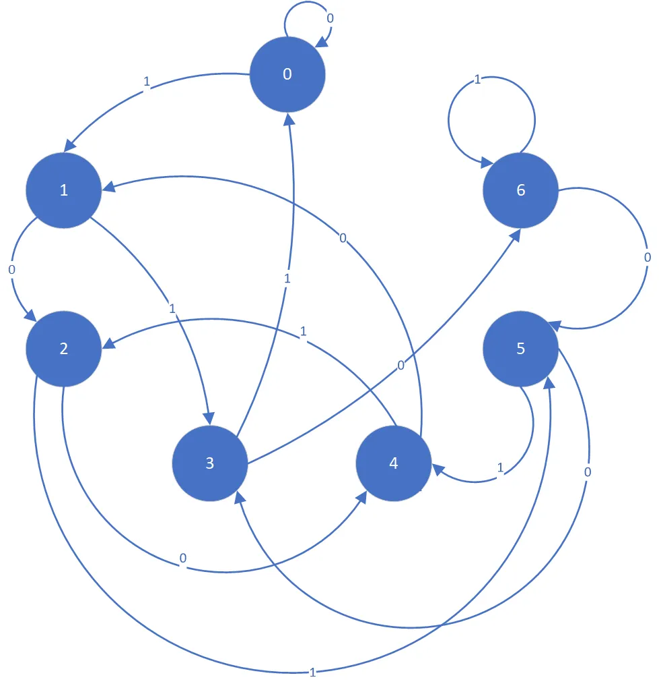
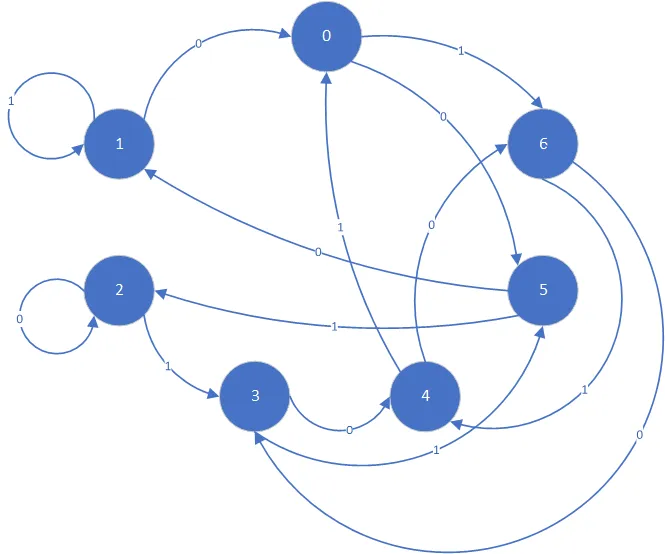
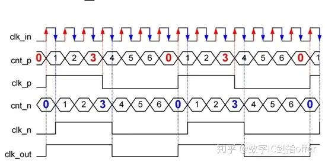

# 数字逻辑电路基础实验

verilog代码在.src文件夹中，使用vivado 2018.3进行仿真。

## 1. 根据电路图写代码

Lab1_task2.v

根据以下电路图完成代码的书写。

## 2. 序列检测 

序列检测分为有重叠检测和无重叠检测；

例如检测序列1101011，我们给出输入：110101101011。

如果是无重叠检测，则只能检测到一个序列：1101011_01011;

如果是有重叠检测，则可以检测到两个这样的序列：11010_11_01011。

### 2.1. 不重叠序列检测

seq_detect.v

随机序列中xxx101101xxx检测序列“101101”（左先），每检测到一个序列输出一个周期的脉冲，输入:clk,rstn,data_in，输出:detector， 仅检测不重叠的101101序列。

### 2.2. 可重叠序列检测

seq_detect_overlap.v

随机序列中xxx101101xxx检测序列“101101”（左先），每检测到一个序列输出一个周期的脉冲，输入:clk,rstn,data_in，输出:detector， 检测可重叠的101101序列。

## 3. 序列求余

Lab2_task2.v

现有16位寄存器。初始值为0。每个时钟周期寄存器的值会左移1位，并且将输入的数据data_in作为寄存器的最低位，寄存器原来的最高位将被丢弃。要求每个周期实时输出该16位寄存器对7求余的余数data_out[2:0]。不能直接用求余运算符。

思路：如果寻求直接求一个给出的16位二进制数对7的余数，会比较麻烦，但是已知从0开始，并且每次移进去1或0，这个过程中的变化是确定的，就可以写出对应状态机。

这是最高位不为0时候的状态机，此时每一次进0/1相当于乘2或者乘2+1，符合这个状态机，如果最高位是1，就不是乘2和乘2加1，不符合这个状态机，需要另设计转移方式！这才是最高位是1时候的转换图。

## 4. FIFO

### 4.1. 同步FIFO

FIFO.v

设计一个同步FIFO，该FIFO深度为16，每个存储单元的宽度为8位，要求产生FIFO为空、满、半满、溢出标志。

其中，clk：输入时钟；rst_n：输入复位信号，低电平有效；w_en：写使能；r_en：读使能；data_w：写入FIFO的数据；data_r：从FIFO中读出的数据；empty：读空信号，指示FIFO为空；full：写满信号，指示FIFO为满；half_full：半满信号；overflow：溢出信号，当FIFO已经满的时候，继续有写入的数据时跳为1。

实验要求：

- 有效，复位后，空信号empty=1，满信号full=0，内部写地址、读地址指针指向0rst_n低。
- clk上升沿根据w_en和r_en信号决定读写，w_en和r_en信号均为高有效。
- 基于提供的tb，不停顿执行完表示功能通过(输出“ndone, without error”)。

要点：

- 判空满方法：指针多一位，可以表示溢出的情况，类似循环指针，两个指针差为最大范围时满，相等时空。
- 数值的地址的读写时，注意空不能读，满不能写。
  

### 4.2. 位宽转换

FIFO_8_to_3.v

基于FIFO进行位宽的转换，要求在数据写入FIFO时使用8bit位宽，读出FIFO时使用3bit位宽。

思路：输出是一个状态机。

## 5. 时钟

### 5.1. 时钟分频

clk_div.v

将主时钟以2为幂次进行分割可以得到同步偶数分频时钟，即21，22，23...分频。电路上可采用D触发器实现，n个触发器可以构成2n次偶数分频。如图1所示，为2分频、4分频电路设计及波形。

用D触发器级联搭建分频电路只能实现2，4，8，16等分频，对于一般的偶数分频，可以通过计数器实现：若要实现N分频（N为偶数），只需将计数器在待分频时钟上升沿触发下循环计数，从0计数到（N/2 -1）后将输出时钟翻转即可实现。

对于奇数分频，就是分别利用待分频时钟的上升沿触发生成一个时钟，然后用下降沿触发生成另一个时钟，然后将两个时钟信号进行或/与运算得到占空比为50%的奇数分频。

占空比为50%的7分频电路波形生成：

### 5.2. 时钟

clock.v

